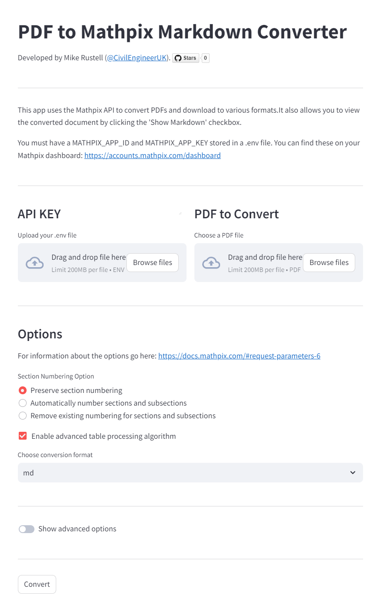

# mathpix-streamlit
Simple streamlit interface to the Mathpix API. Includes markdown viewer. 
Mathpix API code adapted from [this gist](https://gist.github.com/danielgross/3ab4104e14faccc12b49200843adab21)

Click [here](https://simple-mathpix-api.streamlit.app/) to see the app running in Streamlit

